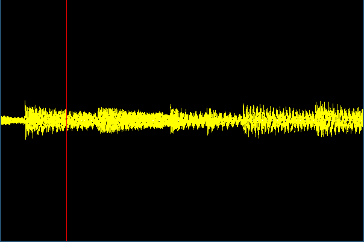
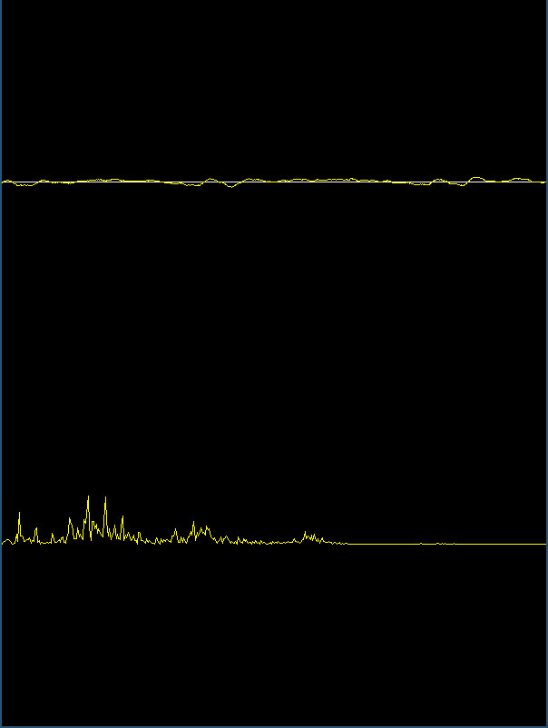

# Audvisa
Audio visualization app with python.   


## Dev
-   this app is still under dev.   
-   it can only show waveform of the sound and some basic animation.
-   next step ofc is to implement some juisy fft (fast fourier transform).

## Programmes
-   audvisa: load a audio file and runs it. <- not complete yet.   
-   micovia: realtime audio visualize to ur device output and input <- pretty good

## How to run
```
    $ pip install -r requirements.txt
    $ python3 audvisa.py
    $ python3 micovisa.py
```
u can change file_name variable to whatever sound u like

## Screenshots
-   its intended to run, imgs are kinda useless its sound.
-   if u are too lazy to run the app like me :o   

